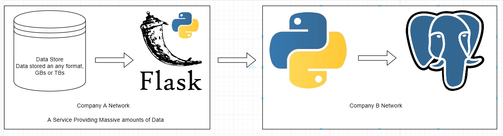
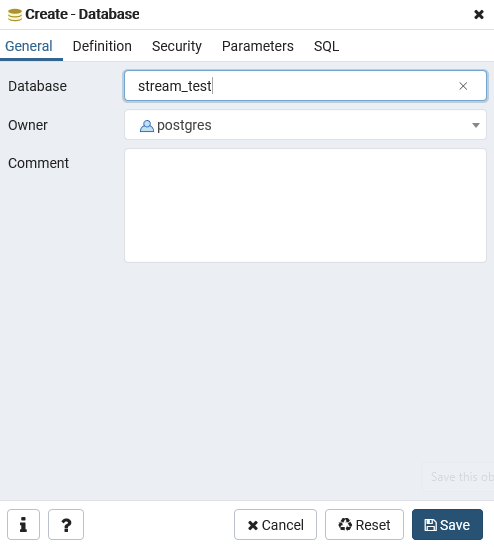
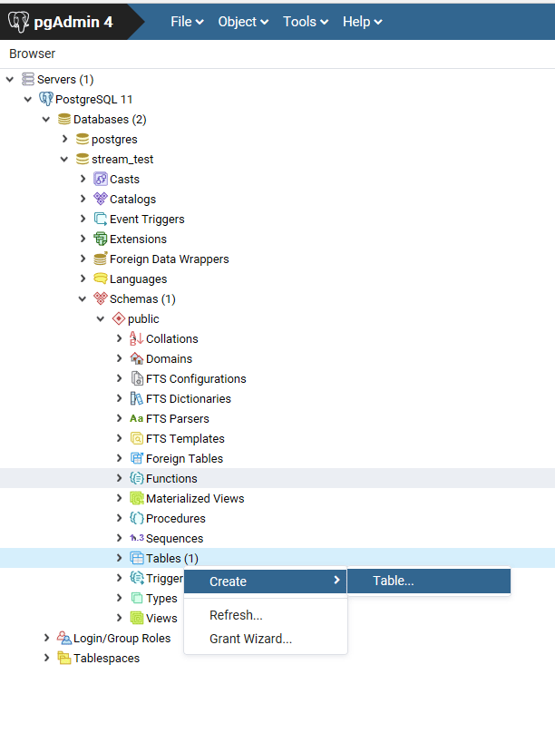
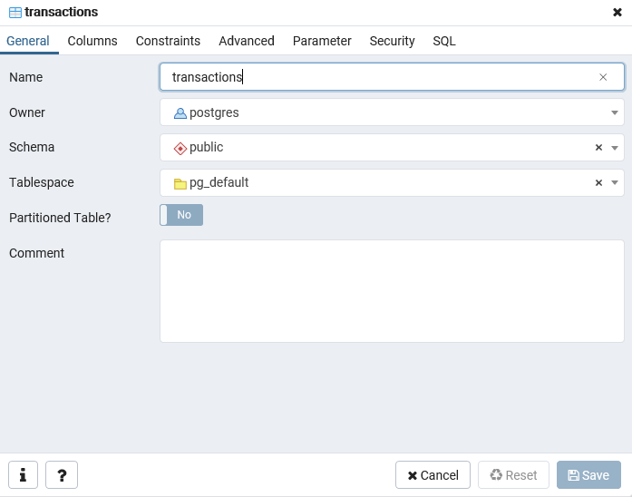
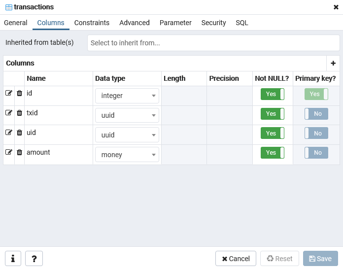
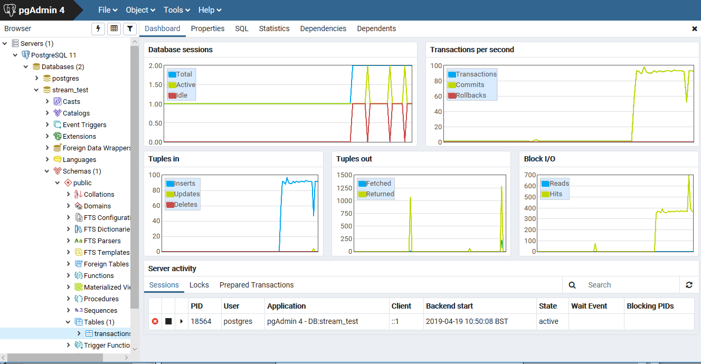

# Stream Data From Flask To Postgres
A tutorial on streaming data from a Flask REST API and streaming the response into PostgreSQL



Using pgAdmin4

1. Create a new database called `stream_test` in a local install of PostgreSQL


2. Create a Table


and name it `transactions`


and give it these colums below


3. Start 'mock_api.py'
```bash
$ python mock_api.py
```

4. Test it by visiting `http://127.0.0.1:5000/very_large_request/10`

```
Example Response of 10 tuples
('22f5f6b0-59ea-4480-a875-665c7c240d23', '44b4e810-7fbf-4ff7-b0f2-9f30f8bb206a', 0.32) ('f264e9a5-f7a6-4b7b-b0f9-d649bc6161d0', '72961696-9eaf-46dd-97f1-e7fb532295ef', 185.13) ('c5738e2d-afc8-48ad-b54e-0129740f2043', '1f7b8189-7934-4814-8f95-db4dca6520e5', 160.92) ('8573707e-1bf7-4f53-a63b-0ce14a00e3c7', '8e8cdacb-c0d8-4a5b-841f-0a57fc07169d', -442.79) ('3ca714c7-5081-46f4-8a65-35ee008c2500', 'cb9f7c8c-87db-4141-b32d-c440d4afab95', 800.43) ('2f5bf700-d1a3-4a42-8cdd-9f28bf7c030f', '7e7ccd63-38b9-4e49-9bb7-fc6ebfd91f74', -74.17) ('1797e5ee-d496-4c7f-a10b-ec69bedde0be', '01d8b804-0603-4163-8558-babfb95e9dab', -649.62) ('26591a3a-650e-4ac9-8a31-6a07a76dde83', 'f8e77946-3c9c-4276-8cee-7e5add4cb40b', 719.06) ('7d67eb18-0c1c-47d6-b67f-839ba4866f5f', '48bd81cb-f0fe-4416-ad62-796613af9cb1', -27.81) ('166d9119-1d6c-4e5d-87f7-c7c1ff8ee366', '8c18c32f-c2b5-4a4a-840d-4326432b128a', 470.55) 
```

5. Start `ingest.py`
Expect lots of lines of output written to the console,

6. Go to pgAdmin4 and inspect your new table as it is filling up with data.


7. Also execute the sql below a few times if you want to see the numbers rise.
```sql
select count(*) from transactions
```

